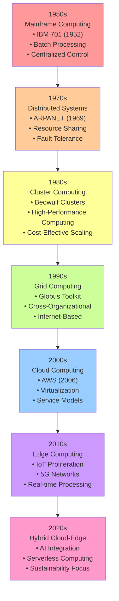

# Diagram 1: Computing Paradigms Evolution Timeline

**Figure 1: Evolution of Computing Paradigms from Mainframe to Hybrid Cloud-Edge Architecture**

This timeline illustrates the technological progression from centralized mainframe systems to modern hybrid cloud-edge architectures, highlighting key innovations and characteristics of each era.