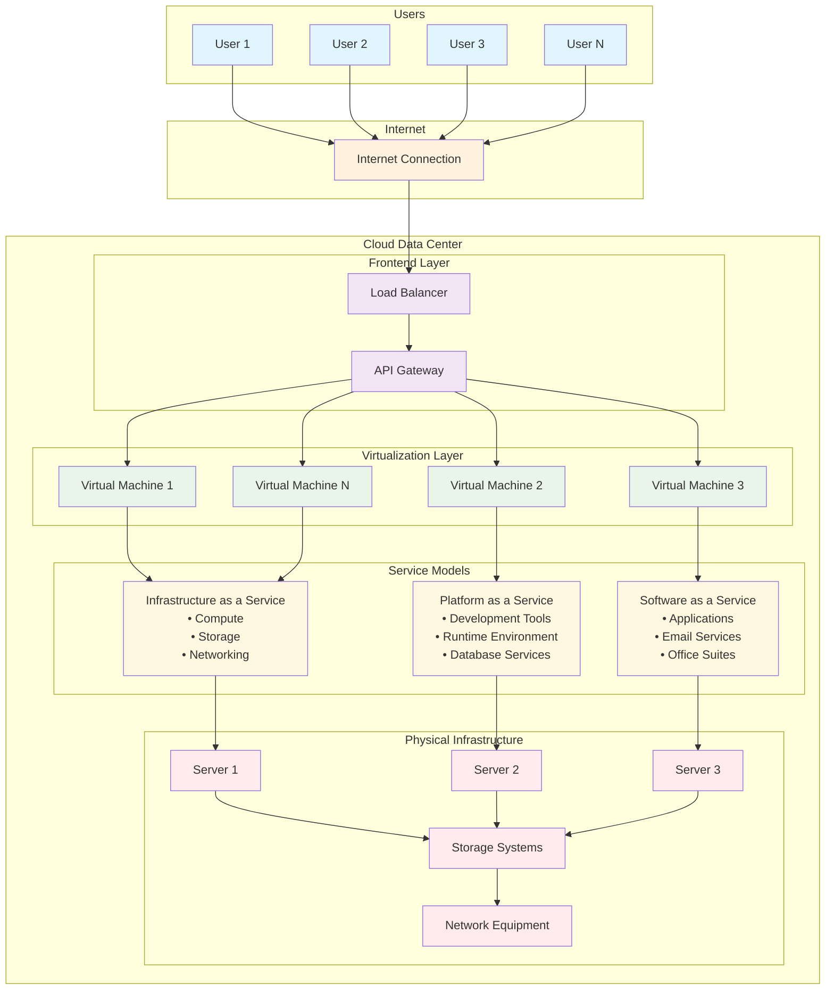

# Diagram 2: Cloud-Only Architecture

**Figure 2: Cloud-Only Architecture with Centralized Data Centers**

This diagram illustrates a traditional cloud-only architecture where all computing resources are centralized in data centers, accessed by users through the Internet. The architecture demonstrates virtualization layers, service models (IaaS, PaaS, SaaS), and multi-tenancy capabilities.