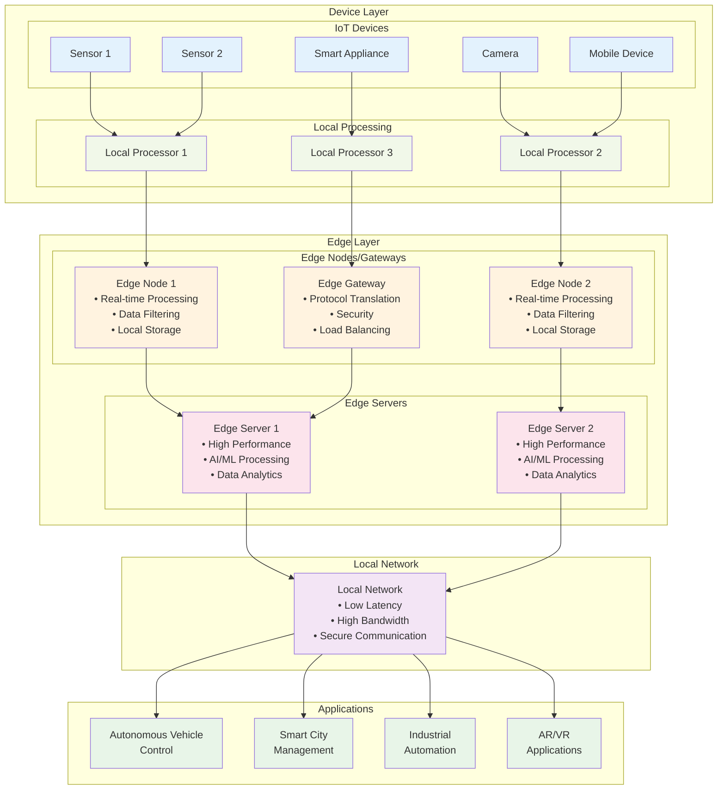

# Diagram 3: Edge-Only Architecture

**Figure 3: Edge-Only Architecture with Decentralized Processing**

This diagram illustrates an edge-only architecture where data processing occurs locally at or near the data source. The architecture shows IoT devices, local processors, edge nodes/gateways, and edge servers working together to provide ultra-low latency processing and reduced bandwidth usage.