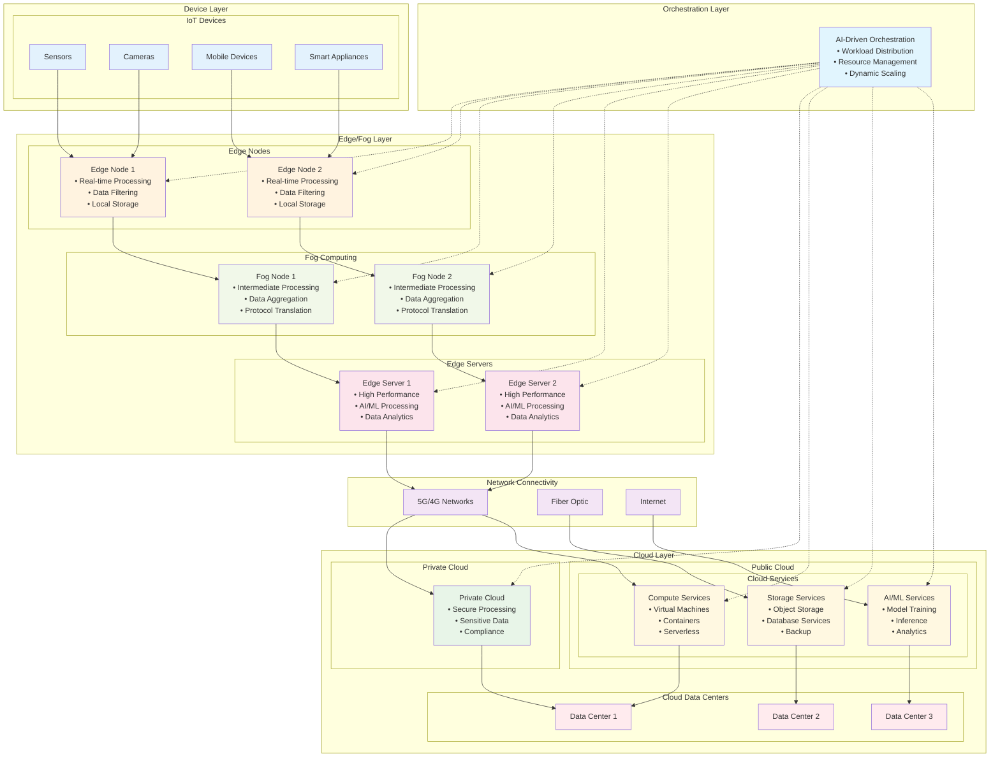

# Diagram 4: Hybrid Cloud-Edge Architecture

**Figure 4: Hybrid Cloud-Edge Architecture with Three-Tier System**

This diagram illustrates a comprehensive hybrid cloud-edge architecture that integrates device, edge/fog, and cloud layers. The architecture demonstrates dynamic workload distribution, AI-driven orchestration, and seamless connectivity between distributed edge nodes and centralized cloud infrastructure.