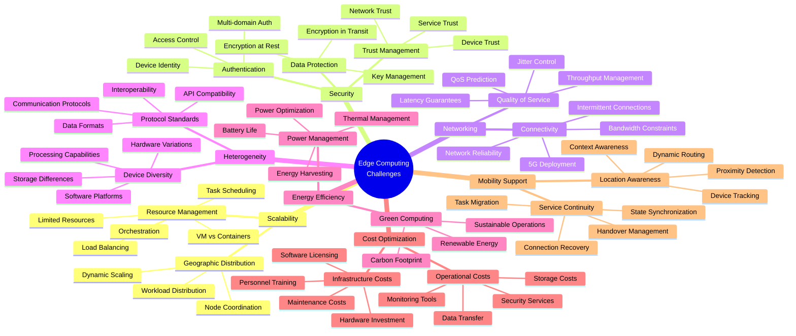

# Diagram 6: Key Challenges Mind Map

**Figure 6: Comprehensive Mind Map of Edge Computing Challenges**

This mind map illustrates the major challenge categories in edge computing, including their sub-categories and specific issues. The challenges are color-coded by severity and type, providing a visual representation of the complex landscape of problems that need to be addressed in edge computing systems.