# EDGE & CLOUD COMPUTING: A REVIEW OF ARCHITECTURE, CHALLENGES, AND FUTURE DIRECTIONS

## Abstract

The proliferation of Internet of Things (IoT) devices, coupled with escalating demands for low-latency and data-intensive services, has fundamentally challenged the adequacy of conventional cloud-based computing paradigms. While cloud computing provides virtually unlimited computational and storage resources, its inherent dependence on remote data centers introduces significant latency, bandwidth constraints, and privacy concerns that impede the deployment of real-time and mission-critical applications such as autonomous vehicles, augmented reality, healthcare monitoring, and industrial automation systems. Edge computing has emerged as a complementary paradigm by relocating computation, storage, and networking capabilities closer to data sources and end-users, thereby minimizing latency and enhancing operational efficiency. The integration of these paradigms—termed the cloud-edge continuum—enables dynamic workload distribution between centralized cloud infrastructures and distributed edge nodes. This hybrid architecture enhances performance, scalability, and reliability while introducing novel complexities in coordination, heterogeneity management, security, cost optimization, and sustainability considerations.

This paper presents a comprehensive review of edge and cloud computing architectures, challenges, and future research directions. The study provides an end-to-end architectural perspective spanning from device, edge, fog, and cloud layers. It establishes a comprehensive taxonomy of challenges across technical, operational, and socio-economic dimensions. The paper examines current solutions and platforms, ranging from research prototypes to industrial deployments, and evaluates existing assessment methodologies while identifying gaps in standardization. Furthermore, it explores emerging research trends including serverless edge computing, federated learning, confidential computing, WebAssembly-based runtimes, AI-driven orchestration, and carbon-aware scheduling. By synthesizing diverse perspectives from academia and industry, this review aims to guide researchers and practitioners in defining the next generation of cloud-edge computing systems.

**Keywords:** Edge Computing, Cloud Computing, IoT, Distributed Systems, Architecture, Challenges, Future Directions

## 1. Introduction

The digital transformation of modern society has been fundamentally shaped by the evolution of computing paradigms, from centralized mainframe systems to distributed cloud infrastructures. Cloud computing has revolutionized how organizations access and utilize computational resources, offering on-demand availability of computing services including storage, processing power, and networking capabilities over the Internet. This paradigm shift has eliminated the need for organizations to maintain physical infrastructure while providing flexible, pay-per-use models that optimize operational costs and resource utilization.

However, the exponential growth of IoT devices and the emergence of latency-sensitive applications have exposed limitations in traditional cloud-centric architectures. The physical distance between data sources and cloud data centers introduces inherent latency that becomes prohibitive for applications requiring real-time responsiveness. Edge computing has emerged as a distributed computing framework that addresses these limitations by enabling IoT devices to process and act on data at the network edge, either locally on the device or through proximate edge servers. This paradigm shift allows devices in remote locations to perform immediate data processing while transmitting only essential information to centralized data centers, thereby minimizing latency and bandwidth consumption.

The significance of edge computing extends beyond mere latency reduction. By pushing data processing and storage capabilities closer to data sources, edge computing enables real-time decision-making for applications demanding ultra-low latency, including autonomous vehicles, industrial automation, and healthcare monitoring systems. The deployment of 5G networks with their ultra-low latency characteristics further amplifies the effectiveness of edge computing, making AI at the edge more viable by reducing bandwidth requirements, enhancing security through local processing, and improving the reliability and efficacy of services across diverse sectors from manufacturing to healthcare.

The integration of cloud and edge computing represents a paradigm shift toward hybrid architectures that combine the strengths of both approaches. This integration is essential for achieving real-time responsiveness while maintaining the computational power and scalability of cloud infrastructures. The collaborative relationship between cloud and edge computing enhances efficiency, reduces costs, and improves scalability by enabling edge devices to perform immediate processing while allowing cloud platforms to conduct comprehensive analysis and centralized management. This symbiotic relationship enables organizations to minimize latency and bandwidth expenses, ensure business continuity during connectivity disruptions, strengthen security through distributed processing, and accelerate innovation through collaborative platforms for developing and deploying AI and machine learning solutions.

## 2. Background and Fundamentals

### 2.1 Evolution of Computing Paradigms

The evolution of computing paradigms has been characterized by a continuous progression from centralized to distributed architectures, driven by technological advances and changing computational requirements. The term "Cloud Computing" was first conceptualized in the 1950s to describe internet-based services, evolving from distributed computing foundations to the sophisticated cloud computing technologies prevalent today. Modern cloud services, exemplified by platforms from Amazon Web Services, Google Cloud Platform, and Microsoft Azure, provide users with access to comprehensive service portfolios stored in distributed cloud infrastructures accessible via the Internet.

### 2.2 Historical Development of Cloud Computing

#### 2.2.1 Mainframe Computing (1950-1970)
Mainframe computers, first introduced in 1951, represent the foundation of modern computing infrastructure. These systems are characterized by exceptional computational power and reliability, capable of handling massive data processing operations and supporting extensive input-output operations. Contemporary mainframes continue to serve critical functions in bulk processing tasks, including online transaction processing and large-scale data analytics. These systems exhibit near-zero downtime with exceptional fault tolerance, making them indispensable for mission-critical applications. However, the substantial cost associated with mainframe systems necessitated the development of alternative computing paradigms.

#### 2.2.2 Distributed Systems (1970-1980)
Distributed systems emerged as a composition of multiple independent computing systems that collectively present a unified interface to users. The primary objective of distributed systems is to optimize resource sharing and utilization efficiency. Key characteristics include scalability, concurrency support, continuous availability, hardware heterogeneity, and fault independence. However, the geographical constraints of distributed systems, requiring all components to be located in proximity, limited their applicability and led to the development of more flexible computing paradigms.

#### 2.2.3 Cluster Computing (1980-1990)
Cluster computing emerged in the 1980s as a cost-effective alternative to mainframe systems. This paradigm connects multiple computing nodes through high-bandwidth networks, providing computational capabilities comparable to mainframes at significantly reduced costs. The modular nature of cluster computing enables easy addition of new nodes, addressing scalability requirements. However, geographical limitations persisted, necessitating the development of grid computing solutions.

#### 2.2.4 Grid Computing (1990-2000)
Grid computing, introduced in the 1990s, addressed geographical constraints by connecting systems across different locations via the Internet. This paradigm enables collaboration between heterogeneous systems belonging to different organizations, creating a distributed computing infrastructure. However, increased distances between nodes introduced new challenges, including limited high-bandwidth connectivity and network-related issues, leading to the evolution toward cloud computing as the "successor of grid computing."

#### 2.2.5 Utility Computing (Late 1990s-2000s)
Utility computing established a service provisioning model for computing resources, including compute services, storage, and infrastructure, delivered on a pay-per-use basis. This model laid the foundation for modern cloud computing service models and pricing structures.

#### 2.2.6 Virtualization (1980-Present)
Virtualization technology, introduced nearly four decades ago, creates virtual layers over physical hardware, enabling multiple operating system instances to run simultaneously on a single physical machine. This technology serves as the foundation for modern cloud computing services, including Amazon EC2 and VMware vCloud. Hardware virtualization remains the most prevalent form of virtualization in contemporary cloud infrastructures.

#### 2.2.7 Web 2.0
Web 2.0 technologies provide the interface through which cloud computing services interact with clients, enabling interactive and dynamic web applications. This technology facilitates the development of social media platforms, collaborative tools, and user-generated content systems. Popular examples include Google Maps, Facebook, and Twitter, demonstrating the transformative impact of Web 2.0 on digital services.

#### 2.2.8 Service Orientation
Service orientation serves as a reference model for cloud computing, supporting low-cost, flexible, and evolvable applications. This paradigm introduced critical concepts including Quality of Service (QoS) and Service Level Agreements (SLAs), establishing the foundation for modern cloud service delivery models.

### 2.3 The Edge Computing Revolution

The edge computing revolution has been driven by the imperative for real-time processing capabilities to support the exponential growth of IoT devices and the requirements of applications such as autonomous vehicles and artificial intelligence systems. These applications demand ultra-low latency and high-bandwidth processing capabilities that must be located proximate to data sources rather than in distant data centers. Key advantages of edge computing include reduced latency, enhanced scalability and reliability, improved security through local data processing, cost reduction through minimized data transmission, and compliance with data privacy regulations through local data processing.

### 2.4 Comparative Analysis of Computing Models

Cloud, fog, and edge computing represent distinct approaches to data processing, each offering unique advantages and limitations:

**Cloud Computing:**
- **Location:** Data processing occurs in large, centralized data centers
- **Advantages:** High processing power, extensive storage capacity, and superior scalability
- **Disadvantages:** Latency due to geographical distance, potential bandwidth constraints, and security concerns related to data transmission
- **Applications:** Web applications, email services, and file storage systems

**Fog Computing:**
- **Location:** Extends cloud capabilities to network edge devices such as routers and gateways
- **Advantages:** Lower latency than cloud computing, improved bandwidth utilization, and enhanced security through proximate processing
- **Disadvantages:** Limited processing power and storage compared to cloud, increased infrastructure complexity
- **Applications:** IoT device data processing in smart manufacturing facilities requiring immediate response

**Edge Computing:**
- **Location:** Processing occurs directly on or adjacent to data-generating devices
- **Advantages:** Ultra-low latency, enhanced responsiveness, and improved security through reduced data transmission
- **Disadvantages:** Limited processing power and storage capacity, specialized hardware requirements, and higher implementation costs
- **Applications:** Real-time sensor data processing for autonomous vehicles where decision speed is critical

## 3. Architectural Analysis

### 3.1 Computing Paradigms Evolution

The evolution of computing paradigms has been characterized by a continuous progression from centralized to distributed architectures, driven by technological advances and changing computational requirements. Figure 1 illustrates this evolution from mainframe computing in the 1950s to modern hybrid cloud-edge architectures.

```mermaid
graph TD
    A["1950s<br/>Mainframe Computing<br/>• IBM 701 (1952)<br/>• Batch Processing<br/>• Centralized Control"] --> B["1970s<br/>Distributed Systems<br/>• ARPANET (1969)<br/>• Resource Sharing<br/>• Fault Tolerance"]
    
    B --> C["1980s<br/>Cluster Computing<br/>• Beowulf Clusters<br/>• High-Performance Computing<br/>• Cost-Effective Scaling"]
    
    C --> D["1990s<br/>Grid Computing<br/>• Globus Toolkit<br/>• Cross-Organizational<br/>• Internet-Based"]
    
    D --> E["2000s<br/>Cloud Computing<br/>• AWS (2006)<br/>• Virtualization<br/>• Service Models"]
    
    E --> F["2010s<br/>Edge Computing<br/>• IoT Proliferation<br/>• 5G Networks<br/>• Real-time Processing"]
    
    F --> G["2020s<br/>Hybrid Cloud-Edge<br/>• AI Integration<br/>• Serverless Computing<br/>• Sustainability Focus"]
    
    style A fill:#ff9999
    style B fill:#ffcc99
    style C fill:#ffff99
    style D fill:#ccff99
    style E fill:#99ccff
    style F fill:#cc99ff
    style G fill:#ff99cc
```



**Figure 1: Evolution of Computing Paradigms from Mainframe to Hybrid Cloud-Edge Architecture**

### 3.2 Cloud Architecture

Cloud architecture employs centralized data centers to provide scalable processing capabilities, leveraging economies of scale and resource virtualization to deliver computing services to distributed users. This architecture is characterized by centralized processing where data is routed to central data centers or public cloud platforms for analysis, processing, and storage. Figure 2 illustrates the cloud-only architecture.

```mermaid
graph TB
    subgraph "Users"
        U1[User 1]
        U2[User 2]
        U3[User 3]
        U4[User N]
    end
    
    subgraph "Internet"
        I[Internet Connection]
    end
    
    subgraph "Cloud Data Center"
        subgraph "Frontend Layer"
            LB[Load Balancer]
            API[API Gateway]
        end
        
        subgraph "Virtualization Layer"
            VM1[Virtual Machine 1]
            VM2[Virtual Machine 2]
            VM3[Virtual Machine 3]
            VM4[Virtual Machine N]
        end
        
        subgraph "Service Models"
            IaaS[Infrastructure as a Service<br/>• Compute<br/>• Storage<br/>• Networking]
            PaaS[Platform as a Service<br/>• Development Tools<br/>• Runtime Environment<br/>• Database Services]
            SaaS[Software as a Service<br/>• Applications<br/>• Email Services<br/>• Office Suites]
        end
        
        subgraph "Physical Infrastructure"
            S1[Server 1]
            S2[Server 2]
            S3[Server 3]
            ST[Storage Systems]
            NW[Network Equipment]
        end
    end
    
    U1 --> I
    U2 --> I
    U3 --> I
    U4 --> I
    
    I --> LB
    LB --> API
    API --> VM1
    API --> VM2
    API --> VM3
    API --> VM4
    
    VM1 --> IaaS
    VM2 --> PaaS
    VM3 --> SaaS
    VM4 --> IaaS
    
    IaaS --> S1
    PaaS --> S2
    SaaS --> S3
    
    S1 --> ST
    S2 --> ST
    S3 --> ST
    
    ST --> NW
    
    style U1 fill:#e1f5fe
    style U2 fill:#e1f5fe
    style U3 fill:#e1f5fe
    style U4 fill:#e1f5fe
    style I fill:#fff3e0
    style LB fill:#f3e5f5
    style API fill:#f3e5f5
    style VM1 fill:#e8f5e8
    style VM2 fill:#e8f5e8
    style VM3 fill:#e8f5e8
    style VM4 fill:#e8f5e8
    style IaaS fill:#fff8e1
    style PaaS fill:#fff8e1
    style SaaS fill:#fff8e1
    style S1 fill:#ffebee
    style S2 fill:#ffebee
    style S3 fill:#ffebee
    style ST fill:#ffebee
    style NW fill:#ffebee
```



**Figure 2: Cloud-Only Architecture with Centralized Data Centers**

**Key Components:**
- **Front-end Systems:** User interfaces and client applications that interact with cloud services
- **Back-end Systems:** Servers, storage systems, and networking infrastructure
- **Network Connectivity:** Internet-based connections linking front-end and back-end components

**Advantages:**
- High scalability and flexibility
- Support for large datasets and complex computations
- Cost-effective resource utilization through virtualization
- Comprehensive security and compliance frameworks

**Applications:**
- Long-term data analytics and business intelligence
- Global supply chain management
- Applications requiring extensive computational resources

### 3.3 Edge Architecture

Edge architecture implements decentralized processing by relocating computing and data processing capabilities closer to data sources, including IoT devices and local gateways. This architecture prioritizes real-time responsiveness and reduced bandwidth consumption. Figure 3 illustrates the edge-only architecture.

```mermaid
graph TB
    subgraph "Device Layer"
        subgraph "IoT Devices"
            S1[Sensor 1]
            S2[Sensor 2]
            S3[Camera]
            S4[Mobile Device]
            S5[Smart Appliance]
        end
        
        subgraph "Local Processing"
            LP1[Local Processor 1]
            LP2[Local Processor 2]
            LP3[Local Processor 3]
        end
    end
    
    subgraph "Edge Layer"
        subgraph "Edge Nodes/Gateways"
            EN1[Edge Node 1<br/>• Real-time Processing<br/>• Data Filtering<br/>• Local Storage]
            EN2[Edge Node 2<br/>• Real-time Processing<br/>• Data Filtering<br/>• Local Storage]
            EN3[Edge Gateway<br/>• Protocol Translation<br/>• Security<br/>• Load Balancing]
        end
        
        subgraph "Edge Servers"
            ES1[Edge Server 1<br/>• High Performance<br/>• AI/ML Processing<br/>• Data Analytics]
            ES2[Edge Server 2<br/>• High Performance<br/>• AI/ML Processing<br/>• Data Analytics]
        end
    end
    
    subgraph "Local Network"
        LN[Local Network<br/>• Low Latency<br/>• High Bandwidth<br/>• Secure Communication]
    end
    
    subgraph "Applications"
        APP1[Autonomous Vehicle<br/>Control]
        APP2[Smart City<br/>Management]
        APP3[Industrial<br/>Automation]
        APP4[AR/VR<br/>Applications]
    end
    
    S1 --> LP1
    S2 --> LP1
    S3 --> LP2
    S4 --> LP2
    S5 --> LP3
    
    LP1 --> EN1
    LP2 --> EN2
    LP3 --> EN3
    
    EN1 --> ES1
    EN2 --> ES2
    EN3 --> ES1
    
    ES1 --> LN
    ES2 --> LN
    
    LN --> APP1
    LN --> APP2
    LN --> APP3
    LN --> APP4
    
    style S1 fill:#e3f2fd
    style S2 fill:#e3f2fd
    style S3 fill:#e3f2fd
    style S4 fill:#e3f2fd
    style S5 fill:#e3f2fd
    style LP1 fill:#f1f8e9
    style LP2 fill:#f1f8e9
    style LP3 fill:#f1f8e9
    style EN1 fill:#fff3e0
    style EN2 fill:#fff3e0
    style EN3 fill:#fff3e0
    style ES1 fill:#fce4ec
    style ES2 fill:#fce4ec
    style LN fill:#f3e5f5
    style APP1 fill:#e8f5e8
    style APP2 fill:#e8f5e8
    style APP3 fill:#e8f5e8
    style APP4 fill:#e8f5e8
```



**Figure 3: Edge-Only Architecture with Decentralized Processing**

**Key Components:**
- **Sensors and IoT Devices:** Data collection and initial processing capabilities
- **Edge Servers:** Local processing and security enforcement
- **Network-Connected Devices:** Communication infrastructure for edge-to-edge and edge-to-cloud connectivity

**Advantages:**
- Reduced latency and enhanced real-time response capabilities
- Minimized bandwidth requirements
- Improved overall system efficiency
- Enhanced security through local data processing

**Applications:**
- Remote medical diagnosis and monitoring
- Emergency shutdown systems in industrial environments
- Real-time decision-making for autonomous vehicles
- Smart city infrastructure management

### 3.4 Hybrid Architecture

Hybrid architecture represents a blended approach that combines private data centers, on-premises infrastructure, and public cloud services with edge computing capabilities. This architecture provides a comprehensive solution that merges the immediate processing needs of edge computing with the scalability and analytical capabilities of cloud platforms. Figure 4 illustrates the hybrid cloud-edge architecture.

```mermaid
graph TB
    subgraph "Device Layer"
        subgraph "IoT Devices"
            D1[Sensors]
            D2[Cameras]
            D3[Mobile Devices]
            D4[Smart Appliances]
        end
    end
    
    subgraph "Edge/Fog Layer"
        subgraph "Edge Nodes"
            EN1[Edge Node 1<br/>• Real-time Processing<br/>• Data Filtering<br/>• Local Storage]
            EN2[Edge Node 2<br/>• Real-time Processing<br/>• Data Filtering<br/>• Local Storage]
        end
        
        subgraph "Fog Computing"
            FN1[Fog Node 1<br/>• Intermediate Processing<br/>• Data Aggregation<br/>• Protocol Translation]
            FN2[Fog Node 2<br/>• Intermediate Processing<br/>• Data Aggregation<br/>• Protocol Translation]
        end
        
        subgraph "Edge Servers"
            ES1[Edge Server 1<br/>• High Performance<br/>• AI/ML Processing<br/>• Data Analytics]
            ES2[Edge Server 2<br/>• High Performance<br/>• AI/ML Processing<br/>• Data Analytics]
        end
    end
    
    subgraph "Cloud Layer"
        subgraph "Private Cloud"
            PC[Private Cloud<br/>• Secure Processing<br/>• Sensitive Data<br/>• Compliance]
        end
        
        subgraph "Public Cloud"
            subgraph "Cloud Services"
                CS1[Compute Services<br/>• Virtual Machines<br/>• Containers<br/>• Serverless]
                CS2[Storage Services<br/>• Object Storage<br/>• Database Services<br/>• Backup]
                CS3[AI/ML Services<br/>• Model Training<br/>• Inference<br/>• Analytics]
            end
        end
        
        subgraph "Cloud Data Centers"
            CDC1[Data Center 1]
            CDC2[Data Center 2]
            CDC3[Data Center 3]
        end
    end
    
    subgraph "Network Connectivity"
        N1[5G/4G Networks]
        N2[Fiber Optic]
        N3[Internet]
    end
    
    subgraph "Orchestration Layer"
        ORCH[AI-Driven Orchestration<br/>• Workload Distribution<br/>• Resource Management<br/>• Dynamic Scaling]
    end
    
    D1 --> EN1
    D2 --> EN1
    D3 --> EN2
    D4 --> EN2
    
    EN1 --> FN1
    EN2 --> FN2
    
    FN1 --> ES1
    FN2 --> ES2
    
    ES1 --> N1
    ES2 --> N1
    
    N1 --> PC
    N1 --> CS1
    N2 --> CS2
    N3 --> CS3
    
    CS1 --> CDC1
    CS2 --> CDC2
    CS3 --> CDC3
    
    PC --> CDC1
    
    ORCH -.-> EN1
    ORCH -.-> EN2
    ORCH -.-> FN1
    ORCH -.-> FN2
    ORCH -.-> ES1
    ORCH -.-> ES2
    ORCH -.-> PC
    ORCH -.-> CS1
    ORCH -.-> CS2
    ORCH -.-> CS3
    
    style D1 fill:#e3f2fd
    style D2 fill:#e3f2fd
    style D3 fill:#e3f2fd
    style D4 fill:#e3f2fd
    style EN1 fill:#fff3e0
    style EN2 fill:#fff3e0
    style FN1 fill:#f1f8e9
    style FN2 fill:#f1f8e9
    style ES1 fill:#fce4ec
    style ES2 fill:#fce4ec
    style PC fill:#e8f5e8
    style CS1 fill:#fff8e1
    style CS2 fill:#fff8e1
    style CS3 fill:#fff8e1
    style CDC1 fill:#ffebee
    style CDC2 fill:#ffebee
    style CDC3 fill:#ffebee
    style N1 fill:#f3e5f5
    style N2 fill:#f3e5f5
    style N3 fill:#f3e5f5
    style ORCH fill:#e1f5fe
```



**Figure 4: Hybrid Cloud-Edge Architecture with Three-Tier System**

**Key Components:**
- **Edge Devices:** Local processing and data collection
- **Local Servers:** Intermediate processing and caching
- **Private Cloud Infrastructure:** Secure, dedicated computing resources
- **Public Cloud Resources:** Scalable, on-demand computing services
- **Integrated Networking:** Seamless connectivity across all components

**Advantages:**
- Optimal balance between real-time processing and comprehensive analytics
- Enhanced flexibility in resource allocation
- Improved cost optimization through workload distribution
- Enhanced security through multi-layered architecture

**Applications:**
- Contemporary healthcare systems (remote diagnostics at edge, population analytics in cloud)
- Manufacturing systems (real-time safety responses at edge, predictive maintenance in cloud)
- Autonomous vehicle systems (immediate driving decisions at edge, fleet learning in cloud)

## 4. Comparative Analysis of Computing Models

Figure 5 provides a comprehensive comparison of cloud, fog, and edge computing paradigms, highlighting their characteristics, performance metrics, and suitability for different use cases.

```mermaid
graph TB
    subgraph "Computing Models Comparison"
        subgraph "Cloud Computing"
            CC[Cloud Computing<br/>📍 Centralized Data Centers<br/>⚡ High Processing Power<br/>💾 Massive Storage<br/>📈 Excellent Scalability<br/>⏱️ High Latency (100-500ms)<br/>💰 Pay-per-use Model<br/>🔒 Centralized Security<br/>📱 Web Applications<br/>📧 Email Services<br/>🗄️ Data Analytics]
        end
        
        subgraph "Fog Computing"
            FC[Fog Computing<br/>📍 Network Edge Devices<br/>⚡ Medium Processing Power<br/>💾 Moderate Storage<br/>📈 Good Scalability<br/>⏱️ Medium Latency (10-100ms)<br/>💰 Moderate Cost<br/>🔒 Distributed Security<br/>🏭 Industrial IoT<br/>🚦 Smart Traffic<br/>🏥 Healthcare Monitoring]
        end
        
        subgraph "Edge Computing"
            EC[Edge Computing<br/>📍 Device/Node Level<br/>⚡ Limited Processing Power<br/>💾 Small Storage<br/>📈 Limited Scalability<br/>⏱️ Ultra-low Latency (1-10ms)<br/>💰 High Initial Cost<br/>🔒 Local Security<br/>🚗 Autonomous Vehicles<br/>🎮 AR/VR Gaming<br/>⚡ Real-time Control]
        end
    end
    
    subgraph "Comparison Matrix"
        subgraph "Performance Metrics"
            PM[Performance Comparison<br/>┌─────────────┬─────────┬─────────┬─────────┐<br/>│ Metric      │ Cloud   │ Fog     │ Edge    │<br/>├─────────────┼─────────┼─────────┼─────────┤<br/>│ Latency     │ High    │ Medium  │ Ultra-low│<br/>│ Processing  │ Excellent│ Good   │ Limited │<br/>│ Storage     │ Massive │ Moderate│ Small   │<br/>│ Scalability │ Excellent│ Good   │ Limited │<br/>│ Cost        │ Low     │ Medium  │ High    │<br/>│ Security    │ Central │ Dist.   │ Local   │<br/>└─────────────┴─────────┴─────────┴─────────┘]
        end
        
        subgraph "Use Case Suitability"
            UC[Use Case Mapping<br/>🟢 Excellent  🟡 Good  🔴 Limited<br/><br/>📊 Big Data Analytics<br/>Cloud: 🟢 Fog: 🟡 Edge: 🔴<br/><br/>🏭 Industrial Automation<br/>Cloud: 🟡 Fog: 🟢 Edge: 🟢<br/><br/>🚗 Autonomous Vehicles<br/>Cloud: 🔴 Fog: 🟡 Edge: 🟢<br/><br/>📱 Mobile Applications<br/>Cloud: 🟢 Fog: 🟢 Edge: 🟡<br/><br/>🎮 Real-time Gaming<br/>Cloud: 🔴 Fog: 🟡 Edge: 🟢]
        end
    end
    
    CC -.-> PM
    FC -.-> PM
    EC -.-> PM
    
    CC -.-> UC
    FC -.-> UC
    EC -.-> UC
    
    style CC fill:#e3f2fd
    style FC fill:#fff3e0
    style EC fill:#f1f8e9
    style PM fill:#fce4ec
    style UC fill:#e8f5e8
```

**Figure 5: Comparative Analysis of Cloud, Fog, and Edge Computing Models**

## 5. Detailed Architecture Analysis

### 4.1 Cloud-Only Architecture

Cloud-only architecture represents a computing model where organizations rely exclusively on centralized cloud data centers for their computing infrastructure, eliminating the need for on-premises hardware management. This model is characterized by renting computational capacity from third-party vendors, accessing services via the Internet, and leveraging vendor-managed physical infrastructure.

**Key Characteristics:**
- **Off-site Infrastructure:** All computing, storage, and networking resources are hosted in large data centers operated by cloud service providers
- **Internet Access:** Resources are accessed over the Internet rather than through direct on-premises connections
- **Shared Resources:** Virtualization enables multiple organizations to share physical hardware, achieving economies of scale
- **Managed Services:** Providers handle infrastructure management, upgrades, and maintenance
- **Dynamic Scalability:** Resources can be rapidly provisioned and de-provisioned to meet changing demands

**Benefits:**
- **Scalability:** Rapid scaling capabilities to handle unpredictable demand patterns
- **Cost Efficiency:** Pay-per-use pricing models reduce initial capital expenditures
- **Flexibility:** Quick application deployment and technology adoption
- **Security:** Comprehensive security measures and redundancy provided by vendors
- **Operational Efficiency:** Elimination of physical hardware management responsibilities

**Service Examples:**
Cloud-only architecture supports diverse digital services including social media platforms, e-commerce systems, and enterprise software solutions.

### 4.2 Edge-Only Architecture

Edge-only architecture implements a decentralized computing model that relocates processing, storage, and networking functions to the network edge, proximate to data sources and end-users. This architecture prioritizes low latency, enhanced performance, and reduced bandwidth consumption through local computation on IoT sensors, gateways, and edge servers.

**Key Characteristics:**
- **Decentralization:** Computation occurs at multiple distributed locations rather than centralized facilities
- **Proximity to Data Sources:** Processing and storage are located close to data generation points
- **Ultra-Low Latency:** Local processing eliminates data transmission delays to central servers
- **Bandwidth Efficiency:** Local data processing and filtering reduce core network traffic
- **Enhanced Reliability:** Distributed architecture provides resilience against central server failures

**Advantages:**
- **Real-time Applications:** Support for near-instantaneous responses in gaming, autonomous driving, and AR/VR applications
- **Improved User Experience:** Faster and more responsive services through reduced processing delays
- **Scalability:** Distributed computational load across multiple edge nodes
- **Cost Efficiency:** Reduced bandwidth costs and data transmission expenses

**Applications:**
- **Internet of Things (IoT):** Local processing of sensor data for intelligent automation
- **Smart Cities:** Real-time traffic management, public safety, and environmental monitoring
- **Autonomous Vehicles:** Real-time sensor data processing for critical driving decisions
- **Edge Content Delivery Networks (CDNs):** Proximate content serving for improved access speeds

### 4.3 Hybrid Cloud-Edge Architecture

Hybrid cloud-edge architecture represents a multi-tier system that integrates public and private clouds with edge computing to create a decentralized, flexible, and scalable environment. This architecture combines remote edge devices, proximate fog nodes, and central cloud platforms, interconnected to optimize performance, minimize latency, and distribute resources efficiently.

**Key Components:**
- **Cloud Platforms:** Central infrastructure providing extensive storage, data processing, and advanced services
- **Edge Nodes:** Local servers and devices (IoT devices, gateways, routers) managing data near its origin
- **Fog Nodes:** Intermediate processing layers between edge devices and cloud, offering enhanced processing capabilities
- **Network Connectivity:** Communication infrastructure enabling data transfer and synchronization across all tiers

**Operational Workflow:**
1. **Data Processing:** Initial processing occurs at the edge for real-time insights and data reduction
2. **Fog/Cloud Collaboration:** Complex operations are transferred to fog nodes or central cloud for comprehensive analysis
3. **Resource Optimization:** Dynamic management of computing and network resources across tiers

**Benefits:**
- **Reduced Latency:** Edge and fog processing minimize response times
- **Enhanced Flexibility:** Applications and data can be deployed based on performance, security, and cost requirements
- **Improved Efficiency:** Optimal resource utilization and operational cost management
- **Scalability:** Modular architecture supports easy integration of new devices and technologies

**Use Cases:**
- **Industrial Automation:** Real-time equipment monitoring and control
- **Smart Cities:** Sensor data processing and traffic management
- **Autonomous Systems:** Rapid decision-making for autonomous vehicles and aircraft

## 6. Challenges in Edge and Cloud Computing

The implementation of edge and cloud computing systems presents numerous challenges that span technical, operational, and socio-economic dimensions. These challenges require sophisticated solutions as traditional centralized cloud practices often prove inadequate for the specific requirements of edge environments. Figure 6 illustrates the comprehensive landscape of challenges in edge computing.


**Figure 6: Comprehensive Mind Map of Edge Computing Challenges**

### 6.1 Scalability and Resource Management

The geographically distributed nature of edge computing and limited resource availability create significant challenges for scaling and optimal resource allocation.

**Virtual Machines versus Containers:**
Virtual machines (VMs) provide high isolation but introduce substantial resource overhead, making them less suitable for resource-constrained edge devices. Containers offer lightweight alternatives with minimal overhead, making them more appropriate for edge environments. However, containerization in edge computing presents challenges in orchestration and security management.

**Orchestration Challenges:**
Workload management and coordination across heterogeneous edge nodes require sophisticated orchestration tools capable of managing deployment, scaling, and load balancing in decentralized environments. These orchestration systems are still evolving compared to their cloud counterparts.

**Scheduling Complexity:**
Efficient task scheduling across geographically dispersed, resource-limited edge nodes presents significant challenges. The dynamic nature of edge networks and resource constraints necessitate novel scheduling algorithms that optimize performance, latency, and energy consumption simultaneously.

### 6.2 Network Connectivity and Reliability

Establishing and maintaining stable network connectivity in edge environments presents unique challenges due to the distributed nature of edge nodes and varying network conditions.

**5G Network Challenges:**
While 5G networks enable edge computing, their deployment introduces new challenges including scalability issues with massive numbers of 5G-enabled devices and management complexity. Ensuring ultra-low latency for industrial IoT applications requires specialized network configurations and careful workload placement strategies.

**Ultra-Low Latency Requirements:**
Autonomous vehicles and augmented reality applications require predictable, real-time performance. Network congestion and intermittent connectivity can introduce latency variability (jitter) that adversely affects application performance.

**Quality of Service (QoS) Prediction:**
With increasing numbers of services and users, predicting edge service performance to meet QoS requirements becomes essential. This requires sophisticated prediction models capable of handling the dynamic and distributed nature of edge environments.

### 6.3 Security and Privacy

The decentralized nature of edge computing enhances privacy through local data processing but also expands the attack surface, creating new security challenges.

**Data Encryption:**
Protecting data both at rest (on devices) and in transit (between devices and cloud) is critical for securing sensitive information. Implementing strong encryption on resource-constrained edge devices presents technical challenges.

**Authentication Challenges:**
The decentralized nature of edge environments complicates authentication processes. Managing and authenticating large, dynamic networks of devices, users, and services across multiple domains requires robust identity management systems.

**Trust and Security:**
Low default security implementations in IoT devices reduce user confidence. Establishing trust relationships requires transparency in security practices, regular security updates, and strict access control mechanisms.

### 6.4 Heterogeneity Management

The diversity of devices, hardware, and network protocols in edge environments creates significant management and interoperability challenges.

**Device Diversity:**
Edge ecosystems typically comprise heterogeneous devices ranging from simple IoT sensors with limited processing capabilities to high-performance edge servers. This diversity complicates standardization of deployment and management procedures.

**Hardware Variations:**
Edge devices exhibit varying hardware architectures with different CPU, memory, and storage capacities. This necessitates flexible applications and services or standardized software interfaces for compatibility.

**Network Protocol Diversity:**
Edge environments incorporate multiple network protocols and connectivity standards, creating interoperability challenges and complicating communication between devices from different manufacturers.

### 6.5 Energy Efficiency

Energy efficiency represents a critical concern in edge computing, particularly for battery-powered IoT and mobile devices.

**Power Constraints:**
Mobile devices and IoT sensors have limited power supplies, making high computational loads significant sources of battery drain. Energy optimization must be addressed as a multi-objective problem balancing power consumption and performance.

**Thermal Management:**
Computationally intensive workloads on edge devices generate substantial heat. Most edge deployments lack sophisticated cooling systems, particularly in harsh or remote environments.

**Energy Optimization Algorithms:**
Developing intelligent algorithms that can adaptively scale computation based on available resources and power levels represents a critical research area.

### 6.6 Cost Optimization

While edge computing reduces bandwidth costs through local data processing, it introduces new costs that must be managed to ensure return on investment.

**High Initial Costs:**
Establishing edge infrastructure requires significant investment in specialized hardware, software, and connectivity, which may be prohibitive for smaller organizations.

**Distributed Infrastructure Management:**
The cost of installing, monitoring, and maintaining numerous distributed edge nodes is substantial. Physical security and remote management add to the total cost of ownership.

**Hidden Costs:**
Edge deployments may involve unexpected costs including SaaS subscriptions for orchestration software, data transfer surcharges, and specialized personnel requirements.

### 6.7 Mobility Support

Supporting user and device mobility between edge nodes presents unique challenges that can affect application performance.

**Service Continuity:**
As mobile devices move between edge nodes, maintaining continuous service becomes critical. Applications requiring constant processing must support robust task migration mechanisms for efficient handovers.

**Location Awareness:**
Systems must accurately and dynamically determine mobile device locations to route traffic to the nearest and most appropriate edge node.

**Dynamic Resource Allocation:**
Networks must dynamically reallocate resources to accommodate moving users, creating scheduling and load-balancing challenges that traditional techniques cannot easily address.

## 7. Applications and Use Cases

### 7.1 Smart Cities

Smart cities leverage digital technologies to enhance citizen services and improve urban livability through interconnected systems and real-time data processing.

**Healthcare Applications:**
- **Remote Monitoring:** Interconnected sensors and wearables enable healthcare professionals to monitor patient vital signs and track health metrics remotely
- **Emergency Response:** Automated systems can contact emergency services and transmit critical patient information, reducing response times
- **Chronic Disease Management:** IoT-enabled devices assist patients in managing conditions such as diabetes and heart disease with real-time feedback and medication reminders

**Telesurgery:**
Advanced telesurgery systems enable surgeons to perform procedures remotely using robotics and high-speed, low-latency communication networks such as 5G. This technology overcomes geographical barriers, bringing specialized surgical care to remote and underserved regions.

### 7.2 Autonomous Vehicles

Autonomous vehicles (AVs) represent self-driving or driverless cars capable of perceiving their environment and operating independently with minimal human intervention.

**Key Technologies:**
AVs employ sophisticated sensor arrays including radar, LiDAR, and cameras, combined with advanced algorithms and high-performance processors for real-time decision-making.

**Automation Levels:**
Driving automation is classified into six levels, ranging from Level 0 (no automation) to Level 5 (full automation in all environments).

**Applications:**
Beyond passenger vehicles, autonomous technology is being developed for freight transportation, public transit, and last-mile delivery to improve efficiency and safety.

### 7.3 Augmented and Virtual Reality

Augmented Reality (AR) and Virtual Reality (VR) create immersive experiences that extend beyond gaming into diverse industries.

**Gaming Applications:**
- **AR Gaming:** Digital content overlaid on the real world using mobile devices (e.g., Pokémon GO)
- **VR Gaming:** Completely immersive virtual environments using specialized headsets (e.g., Beat Saber)

**Industrial Applications:**
- **AR in Retail:** Applications enabling customers to visualize products in their environment before purchase
- **VR in Healthcare:** Surgical training, remote therapy, and pain management for chronic conditions
- **AR for Maintenance:** Technicians using AR glasses to view repair instructions overlaid on equipment

### 7.4 Industry 4.0

Industry 4.0 represents the integration of intelligent digital technologies into manufacturing and industrial processes to create "smart factories."

**Key Technologies:**
- **Industrial Internet of Things (IIoT):** Networked machines and devices enabling data sharing and automated operations
- **AI and Machine Learning:** Processing massive datasets from IIoT to optimize processes, predict maintenance needs, and improve product quality
- **Digital Twins:** Virtual replicas of physical assets, processes, or systems for simulation and optimization

**Impact:**
Industry 4.0 enables mass customization, improved operational efficiency, enhanced quality control, and optimized supply chain management.

### 7.5 Edge AI

Edge AI involves running machine learning models on local devices including smartphones, sensors, and IoT devices rather than cloud servers.

**Key Advantages:**
- **Reduced Latency:** Real-time decisions and predictions on the device itself
- **Enhanced Privacy:** Sensitive data processed locally without network transmission
- **Bandwidth Efficiency:** Reduced network bandwidth requirements as raw data is not transmitted to cloud

**Applications:**
- **Autonomous Vehicles:** Real-time collision avoidance and object detection processed by on-vehicle AI
- **Smart Speakers:** Local voice command processing enabling offline functionality
- **Predictive Maintenance:** Industrial sensors using Edge AI to predict equipment failures before they occur

## 8. Future Directions and Emerging Technologies

### 8.1 AI-Driven Orchestration

AI-driven orchestration applies machine learning to optimize complex, dynamic workload management in cloud, edge, and hybrid environments.

**Predictive Analytics:**
ML models analyze historical data to predict workload demands, enabling proactive resource allocation and preventing performance bottlenecks.

**Real-time Adaptation:**
AI systems dynamically adjust resource allocation based on real-time data streams to address changing workloads and system failures, ensuring optimal performance.

**Cost and Efficiency Optimization:**
ML algorithms optimize workload distribution across platforms to minimize costs and resource waste while maintaining performance requirements.

**Use Case Example:**
In serverless edge environments, AI can schedule function execution on the most suitable edge server, considering latency, computational load, and power efficiency before returning results to the central cloud.

### 8.2 Blockchain for Security in Edge-Cloud Systems

Blockchain technology provides secure, immutable ledgers that enhance security and data integrity in distributed edge-cloud systems, while AI-driven analytics optimize these systems.

**Decentralized Access Control:**
Smart contracts on blockchain can manage access policies for IoT devices and edge nodes in a tamper-proof manner, eliminating single points of failure.

**AI-based Anomaly Detection:**
AI models analyze blockchain transaction patterns to identify malicious behavior and initiate countermeasures, providing dynamic, self-adjusting security that adapts to new threats.

**Data Integrity:**
Each transaction is cryptographically hashed and stored in blocks, ensuring data integrity. AI and machine learning pre-validate data before blockchain recording to prevent tamper-proof but poisoned data histories.

**Example Application:**
Industrial IoT networks protected by blockchain use AI to verify sensor readings from production equipment before recording, preventing compromised sensors from corrupting entire datasets.

### 8.3 Green Computing and Sustainability

AI plays a crucial role in enhancing IT environmental sustainability through improved efficiency and energy consumption management, despite its own energy consumption challenges.

**Algorithmic Efficiency:**
AI contributes to developing more efficient algorithms that minimize computational resource requirements, resulting in reduced energy consumption.

**Data Center Optimization:**
AI-based tools optimize server utilization, cooling systems, and power consumption in data centers, which represent significant energy consumption sources.

**Demand Shaping:**
AI can intelligently shift computational loads to times or locations where cleaner, renewable energy sources are more available on the grid.

**Predictive Maintenance:**
In energy systems, AI optimizes power plant and wind turbine maintenance schedules to ensure efficient, sustainable operations.

### 8.4 6G and Beyond: Network Evolution

Future 6G networks are designed as AI-native systems where AI is an integral design principle rather than an optional component.

**AI-Native Networks:**
6G will enable complete network automation with "zero human touch" operations, fundamentally changing network management paradigms.

**Intelligent Resource Allocation:**
AI will optimize network resource allocation through cost-benefit analysis, enabling customized, scalable, and intelligent services.

**Integrated Sensing and Communications:**
AI will efficiently manage radio resources for both communication and sensing, with AI-assisted interpretation of results.

**AI-as-a-Service (AIaaS):**
6G will expose network functions as services through AIaaS paradigms, enabling third-party developers to create AI-powered applications.

### 8.5 Digital Twins and Metaverse Integration

AI provides intelligence, simulation, and interaction capabilities to digital twins, which are embedded in immersive metaverse environments.

**Data Processing and Analytics:**
AI algorithms process real-time data from physical twins to predict user and system behavior in virtual environments.

**Enhanced User Experience:**
AI and machine learning improve user experience through more realistic and personalized avatar interactions, processing user data to create lifelike digital avatars.

**Collective Intelligence:**
AI-powered frameworks such as Multi-Agent Reinforcement Learning (MARL) build collective intelligence for both physical and virtual objects, simulating immersive metaverse environments.

**Industrial Applications:**
The "industrial metaverse" employs AI-driven digital twins for predictive maintenance, factory planning, and supply chain simulation applications.

### 8.6 Standardization and Interoperability

AI can automate complex data standardization and interoperability processes, which are critical for seamless communication and integration between different systems.

**Automated Standardization:**
AI and ML enable automated cleansing, matching, and formatting of data from disparate sources to conform to standard formats with improved consistency and reduced errors.

**Intelligent Protocols:**
AI analyzes data usage patterns to create more intelligent and effective interoperability protocols.

**Cross-platform Communication:**
AI-based solutions bridge communication gaps between different hardware and software systems, enabling efficient data sharing and interpretation.

**Compliance Management:**
AI can track and maintain compliance with complex and evolving regulatory requirements across different geographical regions.

### 8.7 Serverless Edge Computing

AI is a central enabler of serverless edge computing, supporting intelligent, event-driven functions that execute at the network edge.

**AI-powered Functions (FaaS):**
AI enables event-driven Function-as-a-Service (FaaS) applications to run natively at the edge where data is generated.

**Smart Resource Management:**
AI and deep reinforcement learning (DRL) models optimize runtime configurations, including minimizing cold-start problems by maintaining functions in pre-warmed states.

**Resource Optimization:**
AI-based algorithms optimize serverless function resource utilization by determining cold-start delays and memory allocation based on dynamic workload patterns.

**Scalability:**
The serverless model, enabled by AI-powered automation, allows edge functions to scale rapidly and on-demand without human intervention in infrastructure management.

## 9. Conclusion

This comprehensive review has examined the evolution, architecture, challenges, and future directions of edge and cloud computing systems. The analysis reveals that the integration of cloud and edge computing represents a fundamental paradigm shift toward hybrid architectures that combine the strengths of centralized cloud infrastructures with the responsiveness and efficiency of distributed edge computing.

The architectural analysis demonstrates that while cloud-only architectures provide extensive computational resources and scalability, they face limitations in latency-sensitive applications. Edge-only architectures address these limitations through local processing but face constraints in computational power and resource management. Hybrid cloud-edge architectures emerge as the optimal solution, providing the flexibility to leverage both paradigms based on application requirements.

The challenges identified in this review span multiple dimensions, including scalability and resource management, network connectivity and reliability, security and privacy, heterogeneity management, energy efficiency, cost optimization, and mobility support. These challenges require innovative solutions that go beyond traditional cloud computing practices, necessitating the development of specialized orchestration tools, security frameworks, and optimization algorithms.

The applications and use cases examined demonstrate the transformative potential of edge and cloud computing across diverse sectors, from smart cities and autonomous vehicles to industrial automation and healthcare. These applications highlight the critical importance of real-time processing capabilities and the need for robust, scalable architectures that can support mission-critical operations.

The future directions analysis reveals exciting opportunities in AI-driven orchestration, blockchain-based security, green computing, 6G networks, digital twins, and serverless edge computing. These emerging technologies promise to address current limitations while opening new possibilities for intelligent, autonomous, and sustainable computing systems.

As the field continues to evolve, several key research priorities emerge:

1. **Standardization and Interoperability:** Developing comprehensive standards for edge computing systems to ensure seamless integration and communication between heterogeneous devices and platforms.

2. **Security and Privacy:** Creating robust security frameworks that can protect distributed systems while maintaining performance and usability.

3. **Energy Efficiency:** Developing intelligent algorithms and hardware solutions that can optimize energy consumption while maintaining computational performance.

4. **AI Integration:** Advancing AI-driven orchestration and optimization techniques to create truly intelligent and autonomous edge-cloud systems.

5. **Sustainability:** Implementing green computing practices and carbon-aware scheduling to minimize environmental impact.

The convergence of edge and cloud computing represents a fundamental shift in how we approach distributed computing systems. As IoT devices continue to proliferate and applications become increasingly latency-sensitive, the importance of hybrid architectures will only grow. The research community must continue to address the challenges identified in this review while exploring new opportunities for innovation and advancement.

This review provides a foundation for understanding the current state of edge and cloud computing while highlighting the critical research directions that will shape the future of distributed computing systems. By addressing the challenges and opportunities identified, researchers and practitioners can contribute to the development of next-generation computing systems that are more efficient, secure, sustainable, and capable of meeting the evolving demands of modern applications.

## References

[1] M. Satyanarayanan, "The emergence of edge computing," Computer, vol. 50, no. 1, pp. 30-39, 2017.

[2] W. Shi, J. Cao, Q. Zhang, Y. Li, and L. Xu, "Edge computing: Vision and challenges," IEEE Internet of Things Journal, vol. 3, no. 5, pp. 637-646, 2016.

[3] Y. Mao, C. You, J. Zhang, K. Huang, and K. B. Letaief, "A survey on mobile edge computing: The communication perspective," IEEE Communications Surveys & Tutorials, vol. 19, no. 4, pp. 2322-2358, 2017.

[4] F. Bonomi, R. Milito, J. Zhu, and S. Addepalli, "Fog computing and its role in the internet of things," in Proceedings of the first edition of the MCC workshop on Mobile cloud computing, 2012, pp. 13-16.

[5] A. V. Dastjerdi and R. Buyya, "Fog computing: Helping the internet of things realize its potential," Computer, vol. 49, no. 8, pp. 112-116, 2016.

[6] P. Mach and Z. Becvar, "Mobile edge computing: A survey on architecture and computation offloading," IEEE Communications Surveys & Tutorials, vol. 19, no. 3, pp. 1628-1656, 2017.

[7] T. Qiu, J. Chi, X. Zhou, Z. Ning, M. Atiquzzaman, and D. O. Wu, "Edge computing in industrial internet of things: Architecture, advances and challenges," IEEE Communications Surveys & Tutorials, vol. 22, no. 4, pp. 2462-2488, 2020.

[8] K. Kumar, J. Liu, Y. H. Lu, and B. Bhargava, "A survey of computation offloading for mobile systems," Mobile Networks and Applications, vol. 18, no. 1, pp. 129-140, 2013.

[9] S. Yi, C. Li, and Q. Li, "A survey of fog computing: concepts, applications and issues," in Proceedings of the 2015 workshop on mobile big data, 2015, pp. 37-42.

[10] M. A. Alsheikh, S. Lin, D. Niyato, and H. P. Tan, "Machine learning in wireless sensor networks: Algorithms, strategies, and applications," IEEE Communications Surveys & Tutorials, vol. 16, no. 4, pp. 1996-2018, 2014.

[11] L. M. Vaquero and L. Rodero-Merino, "Finding your way in the fog: Towards a comprehensive definition of fog computing," ACM SIGCOMM Computer Communication Review, vol. 44, no. 5, pp. 27-32, 2014.

[12] C. Mouradian, D. Naboulsi, S. Yangui, R. H. Glitho, M. J. Morrow, and P. A. Polakos, "A comprehensive survey on fog computing: State-of-the-art and research challenges," IEEE Communications Surveys & Tutorials, vol. 20, no. 1, pp. 416-464, 2017.

[13] J. Xu, L. Chen, and S. Ren, "Online learning for offloading and autoscaling in energy harvesting mobile edge computing," IEEE Transactions on Cognitive Communications and Networking, vol. 3, no. 3, pp. 361-373, 2017.

[14] Y. C. Hu, M. Patel, D. Sabella, N. Sprecher, and V. Young, "Mobile edge computing—A key technology towards 5G," ETSI white paper, vol. 11, no. 11, pp. 1-16, 2015.

[15] A. Alrawais, A. Alhothaily, C. Hu, and X. Cheng, "Fog computing for the internet of things: Security and privacy issues," IEEE Internet Computing, vol. 21, no. 2, pp. 34-42, 2017.

[16] M. T. Beck, M. Werner, S. Feld, and S. Schimper, "Mobile edge computing: A taxonomy," in Proceedings of the Sixth International Conference on Advances in Future Internet, 2014, pp. 48-55.

[17] J. Gubbi, R. Buyya, S. Marusic, and M. Palaniswami, "Internet of Things (IoT): A vision, architectural elements, and future directions," Future Generation Computer Systems, vol. 29, no. 7, pp. 1645-1660, 2013.

[18] R. Mahmud, R. Kotagiri, and R. Buyya, "Fog computing: A taxonomy, survey and future directions," in Internet of everything, Springer, 2018, pp. 103-130.

[19] S. K. Datta, C. Bonnet, and J. Haerri, "Fog computing architecture to enable consumer centric internet of things services," in 2015 International Symposium on Consumer Electronics (ISCE), 2015, pp. 1-2.

[20] T. H. Luan, L. Gao, Z. Li, Y. Xiang, G. Wei, and L. Sun, "Fog computing: Focusing on mobile users at the edge," arXiv preprint arXiv:1502.01815, 2015.

[21] M. Chiang and T. Zhang, "Fog and IoT: An overview of research opportunities," IEEE Internet of Things Journal, vol. 3, no. 6, pp. 854-864, 2016.

[22] N. Abbas, Y. Zhang, A. Taherkordi, and T. Skeie, "Mobile edge computing: A survey," IEEE Internet of Things Journal, vol. 5, no. 1, pp. 450-465, 2017.

[23] X. Chen, L. Jiao, W. Li, and X. Fu, "Efficient multi-user computation offloading for mobile-edge cloud computing," IEEE/ACM Transactions on Networking, vol. 24, no. 5, pp. 2795-2808, 2016.

[24] Y. Mao, J. Zhang, and K. B. Letaief, "Dynamic computation offloading for mobile-edge computing with energy harvesting devices," IEEE Journal on Selected Areas in Communications, vol. 34, no. 12, pp. 3590-3605, 2016.

[25] J. Liu, Y. Mao, J. Zhang, and K. B. Letaief, "Delay-optimal computation task scheduling for mobile-edge computing systems," in 2016 IEEE International Symposium on Information Theory (ISIT), 2016, pp. 1451-1455.

[26] S. Sardellitti, G. Scutari, and S. Barbarossa, "Joint optimization of radio and computational resources for multicell mobile-edge computing," IEEE Transactions on Signal and Information Processing over Networks, vol. 1, no. 2, pp. 89-103, 2015.

[27] A. P. Miettinen and J. K. Nurminen, "Energy efficiency of mobile clients in cloud computing," in 2nd USENIX conference on Hot topics in cloud computing, 2010, pp. 4-4.

[28] E. Cuervo, A. Balasubramanian, D. k. Cho, A. Wolman, S. Saroiu, R. Chandra, and P. Bahl, "MAUI: making smartphones last longer with code offload," in Proceedings of the 8th international conference on Mobile systems, applications, and services, 2010, pp. 49-62.

[29] B. G. Chun, S. Ihm, P. Maniatis, M. Naik, and A. Patti, "CloneCloud: elastic execution between mobile device and cloud," in Proceedings of the sixth conference on Computer systems, 2011, pp. 301-314.

[30] S. Kosta, A. Aucinas, P. Hui, R. Mortier, and X. Zhang, "ThinkAir: Dynamic resource allocation and parallel execution in the cloud for mobile code offloading," in 2012 Proceedings IEEE INFOCOM, 2012, pp. 945-953.